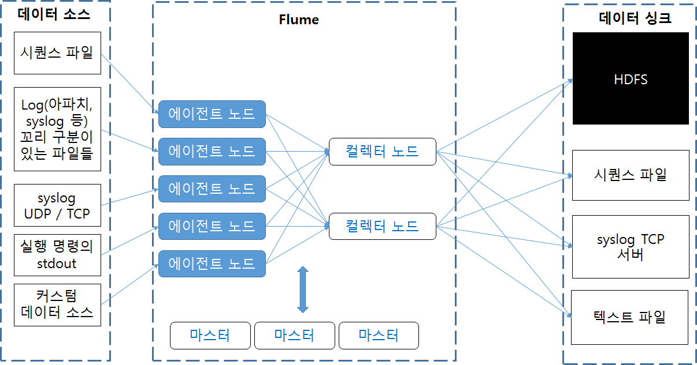

# 01.플롬(Flume)

- 플롬(Flume)
    - 개발 : 클라우데라
    - 수집 데이터 :  대용량 로그 데이터
    - 기본 구성
        
        
        
    - 에이전트 : 데이터를 수집하여 컬렉터에 전달
    - 컬렉터 :  에이전트가 보낸 데이터를 취합하여 데이터를 저장
    - 마스터 : 설정,관리 및 데이터 흐름을 설정한다.
        - 데이터 흐름 설정의 의미는 어떤 에이전트 노드의 데이터를 어떤 컬렉터 노드로 전달할지 어떻게 처리할지에 대한 흐름
    - 기본적인 모든 노드는 source와 sink로 구성
        - 노드 구성
            
            
            
        - source는 어디서 데이터를 수집하는지에 대한 것
        - channel은 데이터를 큐 형태로 쌓아둔다.
        - sink는 어디로 데이터를 보내야 하는지를 지정